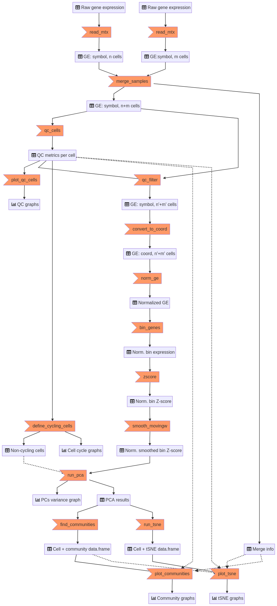
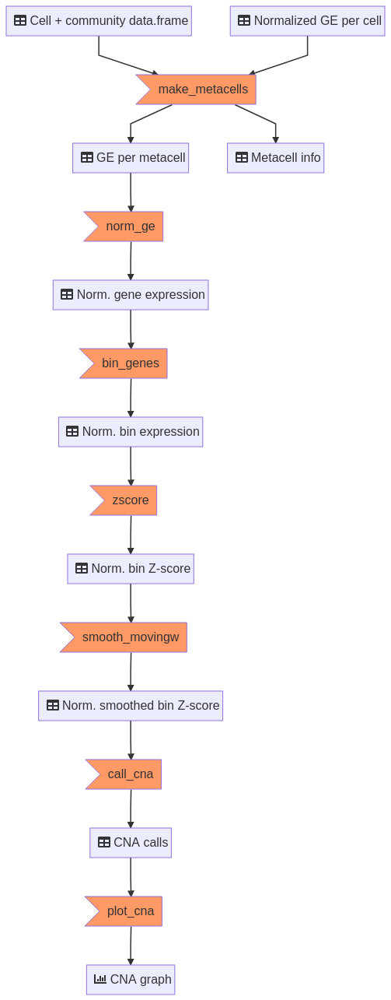

# scCNAutils

[](https://codecov.io/gh/jmonlong/scCNAutils)

A cleaned up version of the functions I used to analyze copy number aberrations in single-cell data. 

Main information below, other information in the [`docs` folder](docs), e.g.:

- [Install on a HPC](docs/README.md#install-on-a-hpc),
- [Memory-efficient version when too many cells](docs/README.md#optimized-version)
- [Getting genes coordinates](docs/README.md#getting-genes-coordinates)
- [Genes associated with cell cycle](docs/README.md#genes-associated-with-cell-cycle)
- [Metacells](docs/README.md#metacells)
- [Tuning the community detection](docs/README.md#tuning-the-community-detection)
- [Rebin coverage data to compare with scRNA-seq CNA signal](docs/README.md#rebinning-coverage-data)

## Citation

Please cite, the protocol chapter describing the methods in Mapping Genetic Interactions:

> Kuzmin E, et al. *Inferring Copy Number from Triple-Negative Breast Cancer Patient Derived Xenograft scRNAseq Data Using scCNA*. Mapping Genetic Interactions (2021). https://doi.org/10.1007/978-1-0716-1740-3_16

Or the first study it was used in:

> Couturier C.P., Ayyadhury S., Le P.U. et al. *Single-cell RNA-seq reveals that glioblastoma recapitulates a normal neurodevelopmental hierarchy.* Nat Commun 11, 3406 (2020). https://doi.org/10.1038/s41467-020-17186-5

See the [data-natcom2020](data-natcom2020) folder for data used in this paper (list of cancer/non-cancer cells).

## Install

To make sure both CRAN and Bioconductor dependencies are installed, the easiest is to use the `biocLite` function from Bioconductor:

```r
source('http://bioconductor.org/biocLite.R')
biocLite('jmonlong/scCNAutils')
```

More instructions about installing locally or on a HPC in the [`docs` folder](docs/README.md#install-on-a-hpc).

## Usage

```r
library(scCNAutils)
cells.df = auto_cna_signal(c('sampleA', 'sampleB'), 'genes.tsv', prefix='example', cell_cycle='cc_genes.tsv')
load('example-ge-coord-norm.RData')
cna.df = auto_cna_call(data, cells.df, prefix='example')
```

where 

- *sampleA* and *sampleB* are folders with *matrix.mtx*, *genes.tsv* and *barcodes.tsv* files.
- *genes.tsv* has coordinates for each genes. Columns: *chr*, *start*, *end*, *symbol*.
- *cc_genes.tsv* has a list of genes for *G1.S*/*G2.M* cell-cycle phases. Columns: *symbol*, *phase*.

More instructions about how to get the *genes.tsv* and *cc_genes.tsv* files in the [`docs` folder](docs).


Instead of a list of folder paths, the input can also be a list of data.frames with a *symbol* column for gene names and then one column per cell. If named, the names of the list can be used as sample names. Otherwise use `sample_names=`.

## Output

*cells.df* contains information at the cell level:

- *tot* the total depth in the cell. QC
- *zeros* the number of genes with no expression. QC
- *mito* the total expression from mitochondrial RNA. QC
- *G1.S*/*G2.M* the cell cycle scores.
- *community* the assigned community.
- *tsne1*/*tsne2* the tSNE coordinates.
- *sample* the sample of origin if multiple samples were merged.
- *orig.cell* the original cell names (before merging samples).

*cna.df* contains information about CNAs at the community level:

- *chr*/*start*/*end* the genomic region.
- *CN* the copy number state: loss (<2), neutral (2) or gain (>2).
- *community* the community tested.
- *prop* the proportion of metacells with this CN state. Higher means higher confidence.
- *nb* the number of metacells with this CN state. 

## Graphs

Graphs are automatically generated by the `auto_*` functions but can also be produced from their output.
For example, to customize the ggplot2 graphs.
The output of the following functions are lists of ggplot2 objects.

```r
qc.ggp = plot_qc_cells(cells.df)
comm.ggp = plot_communities(cells.df)
tsne.ggp = plot_tsne(cells.df)
cna.ggp = plot_cna(cna.df)

## For example changing colors of sample labels in tSNE
tsne.ggp$sample + scale_colour_brewer(palette='Set1')
```

## Interactive graph

Instead of producing many times the same tSNE graph with different coloring, and to be able to zoom or investigate outlier cells, a simple [Shiny app](https://www.rstudio.com/products/shiny/shiny-user-showcase/) with a [bokeh](https://bokeh.pydata.org/en/latest/docs/gallery.html) graph has been implemented. In addition to the zoom and color change, the user can hover over a cell to get its information.

```r
tsne_browser(cells.df)
```

## Workflow

### From gene expression to CNA signal

The `auto_cna_signal` function calls the appropriate functions to go from raw expression to communities and tSNE based on CNA signal.
The internal workflow is as follow:



### From communities to CNA

The `auto_cna_call` function creates metacells per community and call CNAs.
The internal workflow is as follow:



## Next

- Try to use Seurat's functions (e.g. Louvain with gamma and UMAP). *For now I wrapped Python scripts to do that*.
- Example on public cancer data.
- Better colors in graphs.
